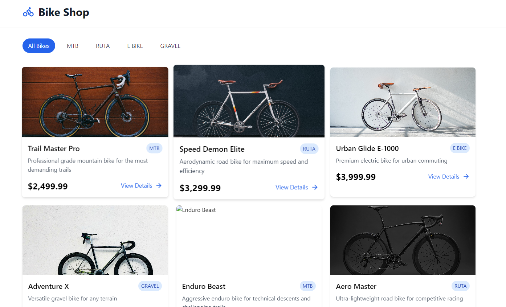
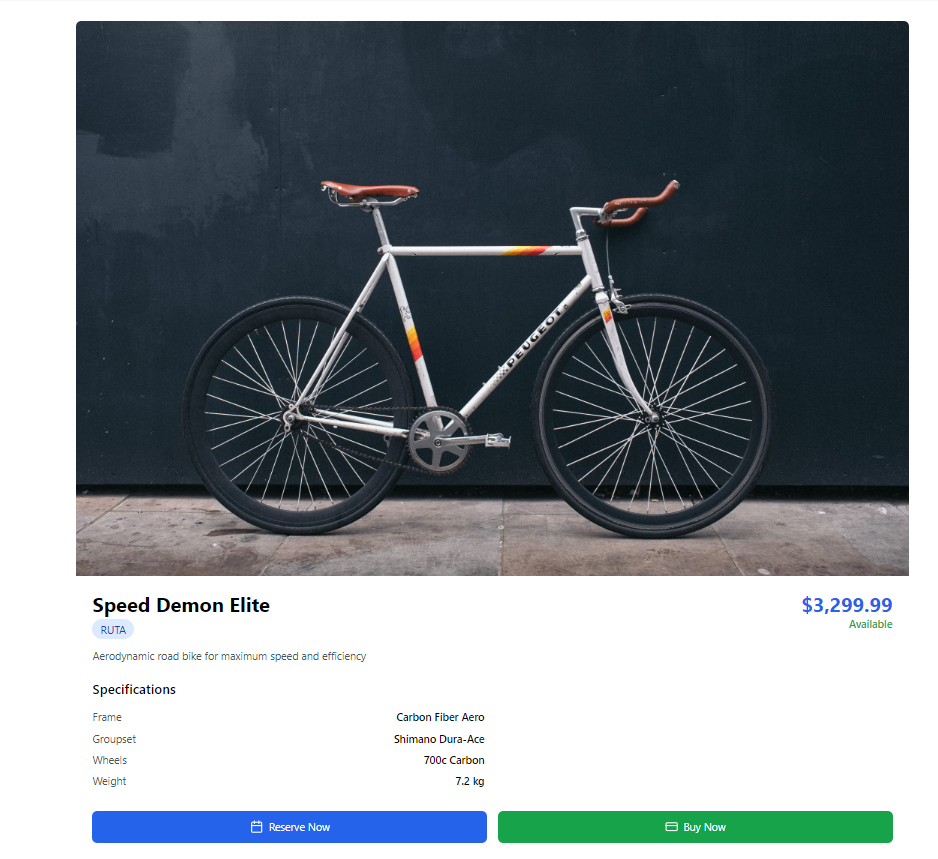

# 🚴 Página Web de Bicicletas

## 📌 Descripción

Este proyecto es una página web dedicada al mundo del ciclismo. Ofrece información sobre diferentes tipos de bicicletas, accesorios, rutas recomendadas y un sistema de compra en línea.

## 🚀 Características

- Catálogo de bicicletas y accesorios
- Sistema de compra en línea
- Blog con consejos y noticias sobre ciclismo
- Buscador de rutas recomendadas
- Diseño responsivo para dispositivos móviles y de escritorio

## 🖼️ Vista Previa





## 🛠️ Tecnologías Utilizadas

- **Frontend:** Astro, Tailwind CSS

## 📦 Instalación

1. Clona el repositorio:
   ```bash
   git clone https://github.com/chicibelito70/Bike-shop.git
   cd repositorio
   ```
2. Instala las dependencias:
   ```bash
   npm install
   ```
3. Configura las variables de entorno en un archivo `.env`.
4. Inicia el servidor:
   ```bash
   npm start
   ```

## 📌 Uso

- Accede a la web desde `http://localhost:3000` (o la URL de despliegue).
- Navega por el catálogo y descubre productos.
- Agrega bicicletas al carrito y finaliza la compra.

## 📜 Licencia

Este proyecto está bajo la licencia MIT.

## 🤝 Contribuciones

Las contribuciones son bienvenidas. Puedes hacer un fork del proyecto y enviar un pull request con mejoras.

## 📧 Contacto

Para cualquier consulta, puedes escribir a: carlosvillavizar07@gmail.com